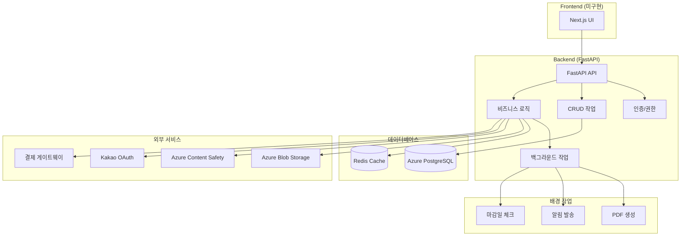
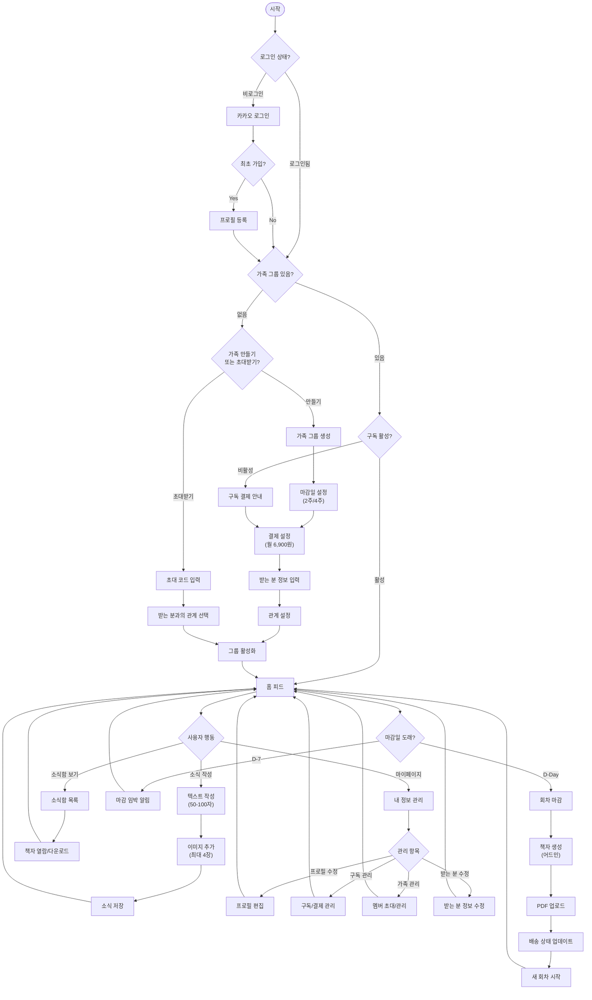
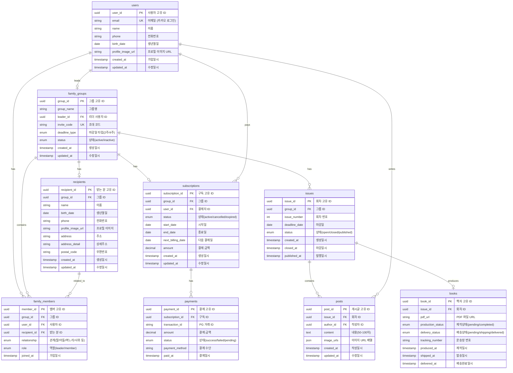

# Family News Service - 가족 소식지 서비스

## 📋 프로젝트 개요

Family News Service는 가족 구성원들이 소식을 공유하고, 이를 정기적으로 책자로 만들어 물리적으로 전달하는 서비스입니다. 사용자들은 텍스트와 이미지를 통해 가족 소식을 작성하고, 시스템이 자동으로 PDF 책자를 생성하여 지정된 주소로 배송합니다.

### 🎯 주요 기능
- **카카오 OAuth 로그인**: 간편한 소셜 로그인
- **가족 그룹 관리**: 초대 코드를 통한 가족 구성원 초대
- **소식 작성**: 텍스트(50-100자) + 이미지(최대 4장) 업로드
- **자동 회차 관리**: 2주/4주 주기로 자동 마감 및 새 회차 생성
- **PDF 책자 생성**: ReportLab을 사용한 자동 PDF 생성
- **구독 관리**: 월 6,900원 구독료 결제 시스템
- **물리적 배송**: 생성된 책자를 실제 주소로 배송

## 🏗️ 시스템 아키텍처

### 기술 스택



### 핵심 컴포넌트

- **FastAPI**: 고성능 비동기 웹 프레임워크
- **SQLAlchemy**: Python ORM (비동기 지원)
- **Azure PostgreSQL**: 메인 데이터베이스
- **Azure Blob Storage**: 파일 저장소
- **Redis**: 캐싱 및 세션 관리
- **ReportLab**: PDF 생성
- **Alembic**: 데이터베이스 마이그레이션

## 🔄 사용자 플로우



## 🗄️ 데이터베이스 설계 (ERD)



## 🔌 API 구조

```mermaid
graph TB
    subgraph "API Gateway"
        MAIN[main.py]
    end
    
    subgraph "API Routes"
        AUTH[auth.py<br/>카카오 OAuth]
        FAMILY[family.py<br/>가족 그룹 관리]
        MEMBERS[members.py<br/>멤버 관리]
        POSTS[posts.py<br/>소식 작성/조회]
        ISSUES[issues.py<br/>회차 관리]
        BOOKS[books.py<br/>책자 관리]
        SUBSCRIPTION[subscription.py<br/>구독/결제]
        PROFILE[profile.py<br/>프로필 관리]
        ADMIN[admin.py<br/>관리자 기능]
    end
    
    subgraph "Services"
        AUTH_SVC[auth_service.py<br/>인증 서비스]
        STORAGE_SVC[storage_service.py<br/>파일 저장]
        PDF_SVC[pdf_service.py<br/>PDF 생성]
        PAYMENT_SVC[payment_service.py<br/>결제 처리]
        NOTIFY_SVC[notification_service.py<br/>알림]
        DEADLINE_SVC[deadline_service.py<br/>마감일]
    end
    
    subgraph "CRUD Operations"
        USER_CRUD[user_crud.py]
        FAMILY_CRUD[family_crud.py]
        MEMBER_CRUD[member_crud.py]
        POST_CRUD[post_crud.py]
        ISSUE_CRUD[issue_crud.py]
        BOOK_CRUD[book_crud.py]
        SUB_CRUD[subscription_crud.py]
    end
    
    subgraph "Background Workers"
        PDF_WORKER[pdf_worker.py<br/>PDF 생성]
        NOTIFY_WORKER[notification_worker.py<br/>알림 발송]
        DEADLINE_WORKER[deadline_worker.py<br/>마감일 체크]
    end
    
    subgraph "External Services"
        AZURE_DB[(Azure PostgreSQL)]
        AZURE_STORAGE[Azure Blob Storage]
        KAKAO[Kakao OAuth]
        PG[결제 게이트웨이]
    end
    
    MAIN --> AUTH
    MAIN --> FAMILY
    MAIN --> MEMBERS
    MAIN --> POSTS
    MAIN --> ISSUES
    MAIN --> BOOKS
    MAIN --> SUBSCRIPTION
    MAIN --> PROFILE
    MAIN --> ADMIN
    
    AUTH --> AUTH_SVC
    FAMILY --> STORAGE_SVC
    POSTS --> STORAGE_SVC
    BOOKS --> PDF_SVC
    SUBSCRIPTION --> PAYMENT_SVC
    
    AUTH_SVC --> USER_CRUD
    FAMILY --> FAMILY_CRUD
    MEMBERS --> MEMBER_CRUD
    POSTS --> POST_CRUD
    ISSUES --> ISSUE_CRUD
    BOOKS --> BOOK_CRUD
    SUBSCRIPTION --> SUB_CRUD
    
    USER_CRUD --> AZURE_DB
    FAMILY_CRUD --> AZURE_DB
    MEMBER_CRUD --> AZURE_DB
    POST_CRUD --> AZURE_DB
    ISSUE_CRUD --> AZURE_DB
    BOOK_CRUD --> AZURE_DB
    SUB_CRUD --> AZURE_DB
    
    STORAGE_SVC --> AZURE_STORAGE
    PDF_SVC --> AZURE_STORAGE
    AUTH_SVC --> KAKAO
    PAYMENT_SVC --> PG
    
    PDF_WORKER --> PDF_SVC
    NOTIFY_WORKER --> NOTIFY_SVC
    DEADLINE_WORKER --> DEADLINE_SVC
```



## 📊 CRUD 작업 매트릭스

### 1. 사용자 도메인 (User Domain)

| 작업 | 메서드 | 엔드포인트 | 권한 | PostgreSQL | Azure Blob |
|------|--------|------------|------|------------|------------|
| 카카오 로그인 | POST | `/auth/kakao/callback` | Public | users 조회/생성 | - |
| 프로필 등록 | POST | `/auth/profile` | Auth | users 업데이트 | profile 이미지 업로드 |
| 프로필 조회 | GET | `/profile/me` | Auth | users 조회 | - |
| 프로필 수정 | PUT | `/profile/me` | Auth | users 업데이트 | profile 이미지 교체 |
| 회원 탈퇴 | DELETE | `/profile/me` | Auth | users 소프트 삭제 | - |

### 2. 가족 그룹 도메인 (Family Group Domain)

| 작업 | 메서드 | 엔드포인트 | 권한 | PostgreSQL | Azure Blob |
|------|--------|------------|------|------------|------------|
| 그룹 생성 | POST | `/family/create` | Auth | family_groups 생성 | - |
| 받는 분 등록 | POST | `/family/{group_id}/recipient` | Leader | recipients 생성 | recipient 프로필 업로드 |
| 초대 코드 생성 | POST | `/family/{group_id}/invite` | Leader | family_groups 업데이트 | - |
| 초대 코드 검증 | POST | `/family/join` | Auth | family_groups 조회 | - |
| 멤버 가입 | POST | `/family/{group_id}/members` | Auth | family_members 생성 | - |
| 멤버 목록 조회 | GET | `/family/{group_id}/members` | Member | family_members 조회 | - |
| 멤버 권한 변경 | PUT | `/family/{group_id}/members/{member_id}` | Leader | family_members 업데이트 | - |
| 멤버 제거 | DELETE | `/family/{group_id}/members/{member_id}` | Leader | family_members 삭제 | - |
| 받는 분 정보 수정 | PUT | `/family/{group_id}/recipient` | Leader | recipients 업데이트 | recipient 프로필 교체 |

### 3. 소식 도메인 (Post Domain)

| 작업 | 메서드 | 엔드포인트 | 권한 | PostgreSQL | Azure Blob |
|------|--------|------------|------|------------|------------|
| 소식 작성 | POST | `/posts` | Member | posts 생성 | 이미지 업로드 (최대 4장) |
| 소식 목록 조회 | GET | `/posts` | Member | posts, issues 조회 | - |
| 소식 상세 조회 | GET | `/posts/{post_id}` | Member | posts 조회 | - |
| 소식 수정 | PUT | `/posts/{post_id}` | Author | posts 업데이트 | 이미지 교체 |
| 소식 삭제 | DELETE | `/posts/{post_id}` | Author | posts 삭제 | 이미지 삭제 |
| 이미지 업로드 | POST | `/posts/{post_id}/images` | Author | posts.image_urls 업데이트 | 이미지 저장 |
| 이미지 삭제 | DELETE | `/posts/{post_id}/images/{image_id}` | Author | posts.image_urls 업데이트 | 이미지 삭제 |

### 4. 회차 도메인 (Issue Domain)

| 작업 | 메서드 | 엔드포인트 | 권한 | PostgreSQL | Azure Blob |
|------|--------|------------|------|------------|------------|
| 현재 회차 조회 | GET | `/issues/current` | Member | issues 조회 | - |
| 회차 목록 조회 | GET | `/issues` | Member | issues 조회 | - |
| 회차 마감 | POST | `/issues/{issue_id}/close` | System | issues 업데이트 | - |
| 새 회차 생성 | POST | `/issues` | System | issues 생성 | - |
| 회차별 소식 조회 | GET | `/issues/{issue_id}/posts` | Member | posts 조회 | - |

### 5. 책자 도메인 (Book Domain)

| 작업 | 메서드 | 엔드포인트 | 권한 | PostgreSQL | Azure Blob |
|------|--------|------------|------|------------|------------|
| 책자 생성 요청 | POST | `/books/generate` | Admin | books 생성 | - |
| PDF 업로드 | POST | `/books/{book_id}/pdf` | Admin | books.pdf_url 업데이트 | PDF 업로드 |
| 책자 목록 조회 | GET | `/books` | Member | books 조회 | - |
| 책자 다운로드 | GET | `/books/{book_id}/download` | Member | books 조회 | SAS URL 생성 |
| 배송 상태 업데이트 | PUT | `/books/{book_id}/delivery` | Admin | books 업데이트 | - |

### 6. 구독 도메인 (Subscription Domain)

| 작업 | 메서드 | 엔드포인트 | 권한 | PostgreSQL | Azure Blob |
|------|--------|------------|------|------------|------------|
| 구독 생성 | POST | `/subscriptions` | Leader | subscriptions 생성 | - |
| 결제 처리 | POST | `/payments/process` | Leader | payments 생성 | - |
| 구독 상태 조회 | GET | `/subscriptions/{group_id}` | Member | subscriptions 조회 | - |
| 결제 수단 변경 | PUT | `/subscriptions/{sub_id}/payment-method` | Leader | subscriptions 업데이트 | - |
| 구독 취소 | DELETE | `/subscriptions/{sub_id}` | Leader | subscriptions 업데이트 | - |
| 결제 내역 조회 | GET | `/payments` | Leader | payments 조회 | - |

## 🚀 설치 및 실행

### 요구사항
- Python 3.8+
- Docker & Docker Compose
- Azure PostgreSQL
- Azure Blob Storage
- Redis (선택사항)

### 환경 설정
```bash
# 1. 저장소 클론
git clone <repository-url>
cd tendayship-backendtest

# 2. 가상환경 생성 및 활성화
python -m venv venv
source venv/bin/activate  # Windows: venv\Scripts\activate

# 3. 의존성 설치
cd backend
pip install -r requirements.txt

# 4. 환경 변수 설정
cp .env.example .env
# .env 파일에 필요한 값들 설정

# 5. 데이터베이스 마이그레이션
alembic upgrade head

# 6. 애플리케이션 실행
uvicorn app.main:app --reload --host 0.0.0.0 --port 8000
```

### Docker 실행
```bash
# 프로덕션 환경
docker-compose up -d

# 개발 환경
docker-compose -f docker-compose.dev.yml up -d
```

## 🔧 개발 가이드

### 프로젝트 구조
```
backend/
├── app/
│   ├── api/           # API 라우터
│   ├── core/          # 핵심 설정
│   ├── crud/          # 데이터베이스 CRUD
│   ├── models/        # SQLAlchemy 모델
│   ├── schemas/       # Pydantic 스키마
│   ├── services/      # 비즈니스 로직
│   ├── utils/         # 유틸리티 함수
│   ├── workers/       # 백그라운드 작업
│   └── main.py        # 애플리케이션 진입점
├── alembic/           # 데이터베이스 마이그레이션
├── tests/             # 테스트 코드
└── requirements.txt   # Python 의존성
```

### 주요 개발 원칙
1. **도메인 중심 설계**: 각 도메인별로 모델, 스키마, CRUD 분리
2. **계층 분리**: API → 서비스 → CRUD → 데이터베이스
3. **비동기 처리**: FastAPI + SQLAlchemy async 지원
4. **타입 안전성**: Pydantic을 통한 데이터 검증
5. **테스트 가능성**: 각 레이어 독립적 테스트 지원

## 📈 현재 개발 상태

### ✅ 완료된 기능 (70%)
- [x] 기본 프로젝트 구조 및 설정
- [x] 데이터베이스 모델 및 스키마
- [x] 인증 시스템 (카카오 OAuth)
- [x] 가족 그룹 관리
- [x] 소식 작성 및 관리
- [x] 회차 관리 시스템
- [x] 파일 업로드 (Azure Blob Storage)
- [x] PDF 생성 서비스
- [x] 구독 및 결제 시스템
- [x] 백그라운드 워커

### 🚧 진행 중인 기능 (20%)
- [ ] 프론트엔드 UI 구현
- [ ] 실시간 알림 시스템
- [ ] 모니터링 및 로깅
- [ ] 성능 최적화

### 📋 향후 개발 계획 (10%)
- [ ] 모바일 앱 (React Native)
- [ ] AI 기반 콘텐츠 추천
- [ ] 다국어 지원
- [ ] 고급 분석 대시보드
- [ ] 마이크로서비스 아키텍처 전환

## 🧪 테스트

```bash
# 테스트 실행
cd backend
pytest

# 커버리지 포함 테스트
pytest --cov=app tests/

# 특정 테스트 파일 실행
pytest tests/test_auth.py
```

## 📚 API 문서

- **Swagger UI**: `http://localhost:8000/docs`
- **ReDoc**: `http://localhost:8000/redoc`
- **OpenAPI JSON**: `http://localhost:8000/openapi.json`

## 🚀 배포

### Docker 배포
```bash
# 이미지 빌드
docker build -t family-news-backend:latest .

# 컨테이너 실행
docker run -d -p 80:80 --env-file .env family-news-backend:latest
```

### 클라우드 배포
- **Azure App Service**: Python 웹앱으로 배포
- **Azure Container Resistry**: Docker 컨테이너로 배포
- **Azure Kubernetes Service**: 대규모 배포 시


## 📄 라이선스

이 프로젝트는 MIT 라이선스 하에 배포됩니다. 자세한 내용은 `LICENSE` 파일을 참조하세요.

