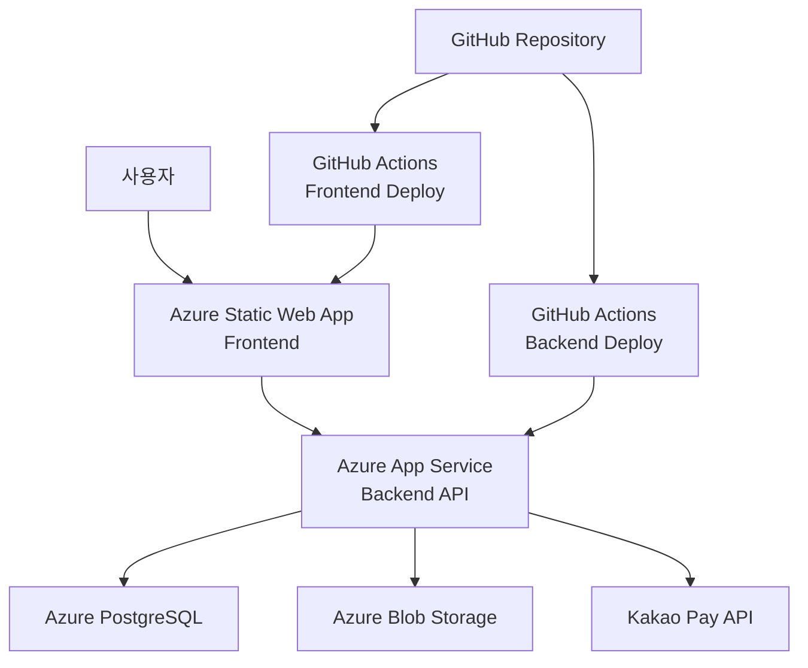

# Azure 배포 가이드: App Service + Static Web App

## 📋 배포 개요

**배포 아키텍처**: Azure App Service (백엔드) + Azure Static Web App (프론트엔드)  
**CI/CD**: GitHub Actions 자동 배포 파이프라인  
**배포 날짜**: 2025-08-18  

### 배포 도메인 정보
- **백엔드 (Azure App Service)**: `tendayapp-f0a0drg2b6avh8g3.koreacentral-01.azurewebsites.net`
- **프론트엔드 (Azure Static Web App)**: `https://kind-sky-0070e521e.2.azurestaticapps.net`

---

## 🏗️ 아키텍처 다이어그램



---

## 🔧 백엔드 수정사항 (Azure App Service)

### 1. CORS 설정 수정 (`backend/app/main.py`)

**현재 코드 (Lines 54-66)**:
```python
app.add_middleware(
    CORSMiddleware,
    allow_origins=[
        "http://localhost:3000",
        "http://127.0.0.1:3000",
        "http://localhost:8000",
        "http://127.0.0.1:8000"
    ],
    allow_credentials=True,
    allow_methods=["GET", "POST", "PUT", "DELETE", "PATCH", "OPTIONS", "HEAD"],
    allow_headers=["*"],
    expose_headers=["*"]
)
```

**수정된 코드**:
```python
app.add_middleware(
    CORSMiddleware,
    allow_origins=[
        "https://kind-sky-0070e521e.2.azurestaticapps.net",
        "http://localhost:3000",  # 개발용 유지
        "http://127.0.0.1:3000",  # 개발용 유지
        "http://localhost:8000",
        "http://127.0.0.1:8000"
    ],
    allow_credentials=True,
    allow_methods=["GET", "POST", "PUT", "DELETE", "PATCH", "OPTIONS", "HEAD"],
    allow_headers=["*"],
    expose_headers=["*"]
)
```

### 2. 예외 핸들러 CORS 수정 (`backend/app/main.py`)

**Lines 89, 101, 191의 하드코딩된 CORS 헤더 수정**:

**현재 코드**:
```python
response.headers["Access-Control-Allow-Origin"] = "http://localhost:3000"
```

**수정된 코드**:
```python
# 환경에 따른 동적 CORS 설정
frontend_url = settings.FRONTEND_URL
response.headers["Access-Control-Allow-Origin"] = frontend_url
```

### 3. 환경 설정 수정 (`backend/app/core/config.py`)

**현재 코드 (Line 168)**:
```python
FRONTEND_URL: str = "http://localhost:3000"
```

**수정된 코드**:
```python
FRONTEND_URL: str = Field(
    default="http://localhost:3000",
    env="FRONTEND_URL",
    description="프론트엔드 URL"
)
```

**결제 콜백 URL 수정 (Lines 141-152)**:
```python
PAYMENT_SUCCESS_URL: str = Field(
    default="https://tendayapp-f0a0drg2b6avh8g3.koreacentral-01.azurewebsites.net/api/subscription/approve",
    env="PAYMENT_SUCCESS_URL"
)
PAYMENT_CANCEL_URL: str = Field(
    default="https://tendayapp-f0a0drg2b6avh8g3.koreacentral-01.azurewebsites.net/api/subscription/cancel",
    env="PAYMENT_CANCEL_URL"
)
PAYMENT_FAIL_URL: str = Field(
    default="https://tendayapp-f0a0drg2b6avh8g3.koreacentral-01.azurewebsites.net/api/subscription/fail",
    env="PAYMENT_FAIL_URL"
)
```

**ALLOWED_HOSTS 수정 (Lines 18-21)**:
```python
ALLOWED_HOSTS: List[str] = Field(
    default=[
        "localhost", 
        "127.0.0.1", 
        "tendayapp-f0a0drg2b6avh8g3.koreacentral-01.azurewebsites.net"
    ],
    description="허용된 호스트 목록"
)
```

### 4. 미들웨어 강화 (`backend/app/api/middleware.py`)

**보안 헤더 미들웨어 강화**:
```python
class SecurityHeadersMiddleware(BaseHTTPMiddleware):
    """보안 헤더 추가 미들웨어"""
    
    async def dispatch(self, request: Request, call_next):
        response = await call_next(request)
        
        # 기존 보안 헤더
        response.headers["X-Content-Type-Options"] = "nosniff"
        response.headers["X-Frame-Options"] = "DENY"
        response.headers["X-XSS-Protection"] = "1; mode=block"
        
        # Azure 배포용 추가 보안 헤더
        response.headers["Strict-Transport-Security"] = "max-age=31536000; includeSubDomains"
        response.headers["Referrer-Policy"] = "strict-origin-when-cross-origin"
        response.headers["Content-Security-Policy"] = (
            "default-src 'self'; "
            "script-src 'self' 'unsafe-inline' 'unsafe-eval' https://kind-sky-0070e521e.2.azurestaticapps.net; "
            "style-src 'self' 'unsafe-inline' https://kind-sky-0070e521e.2.azurestaticapps.net; "
            "img-src 'self' data: https: blob:; "
            "connect-src 'self' https://tendayapp-f0a0drg2b6avh8g3.koreacentral-01.azurewebsites.net"
        )
        
        return response
```

---

## 🌐 프론트엔드 수정사항 (Azure Static Web App)

### 1. API 기본 URL 환경변수 설정 (`src/services/api.ts`)

**현재 코드 (Line 15)**:
```typescript
const API_BASE_URL = process.env.REACT_APP_API_BASE_URL || 'http://localhost:8000/api';
```

**수정 필요 없음** - 환경변수로 처리됩니다.

### 2. 빌드 설정 수정 (`package.json`)

**현재 코드 (Line 47)**:
```json
"proxy": "http://localhost:8000"
```

**수정된 코드** (proxy 제거):
```json
{
  "name": "family-news-frontend",
  "version": "0.1.0",
  "private": true,
  "dependencies": {
    // ... 기존 dependencies
  },
  "scripts": {
    "start": "react-scripts start",
    "build": "react-scripts build",
    "test": "react-scripts test",
    "eject": "react-scripts eject"
  },
  // proxy 제거됨
  "eslintConfig": {
    // ... 기존 설정
  },
  "browserslist": {
    // ... 기존 설정
  },
  "devDependencies": {
    // ... 기존 devDependencies
  }
}
```

### 3. Azure Static Web App 설정 파일 생성

**`staticwebapp.config.json` (프로젝트 루트에 생성)**:
```json
{
  "routes": [
    {
      "route": "/api/*",
      "allowedRoles": ["anonymous"]
    },
    {
      "route": "/*",
      "serve": "/index.html",
      "statusCode": 200
    }
  ],
  "navigationFallback": {
    "rewrite": "/index.html",
    "exclude": ["/images/*.{png,jpg,gif}", "/css/*"]
  },
  "mimeTypes": {
    ".json": "text/json"
  },
  "globalHeaders": {
    "content-security-policy": "default-src https: 'unsafe-eval' 'unsafe-inline'; object-src 'none'"
  },
  "responseOverrides": {
    "401": {
      "redirect": "/login",
      "statusCode": 302
    },
    "403": {
      "redirect": "/unauthorized",
      "statusCode": 302
    },
    "404": {
      "redirect": "/",
      "statusCode": 302
    }
  }
}
```

---

## 📦 환경변수 설정

### Azure App Service 환경변수

**애플리케이션 설정**에서 다음 환경변수들을 설정해야 합니다:

```bash
# 기본 설정
APP_NAME=Family News Service
APP_VERSION=1.0.0
DEBUG=false
API_PREFIX=/api

# Frontend URL
FRONTEND_URL=https://kind-sky-0070e521e.2.azurestaticapps.net

# 보안 설정
SECRET_KEY=your-32-char-secret-key-here
ACCESS_TOKEN_EXPIRE_MINUTES=1440

# 데이터베이스 설정
POSTGRES_SERVER=your-postgres-server.postgres.database.azure.com
POSTGRES_USER=your-username
POSTGRES_PASSWORD=your-password
POSTGRES_DB=family_news_db
POSTGRES_PORT=5432
POSTGRES_SSL_MODE=require

# Azure Storage 설정
AZURE_STORAGE_CONNECTION_STRING=DefaultEndpointsProtocol=https;AccountName=...
AZURE_STORAGE_ACCOUNT_NAME=your-storage-account
AZURE_STORAGE_ACCOUNT_KEY=your-storage-key
AZURE_STORAGE_CONTAINER_NAME=family-news

# 카카오 OAuth 설정
KAKAO_CLIENT_ID=your-kakao-client-id
KAKAO_CLIENT_SECRET=your-kakao-client-secret
KAKAO_REDIRECT_URI=https://kind-sky-0070e521e.2.azurestaticapps.net/auth/kakao/callback

# 카카오페이 설정
KAKAO_PAY_SECRET_KEY=your-kakaopay-secret-key
KAKAO_PAY_CID=your-cid
KAKAO_PAY_CID_SUBSCRIPTION=your-subscription-cid
KAKAO_PAY_API_HOST=https://open-api.kakaopay.com

# 결제 콜백 URL
PAYMENT_SUCCESS_URL=https://tendayapp-f0a0drg2b6avh8g3.koreacentral-01.azurewebsites.net/api/subscription/approve
PAYMENT_CANCEL_URL=https://tendayapp-f0a0drg2b6avh8g3.koreacentral-01.azurewebsites.net/api/subscription/cancel
PAYMENT_FAIL_URL=https://tendayapp-f0a0drg2b6avh8g3.koreacentral-01.azurewebsites.net/api/subscription/fail
PAYMENT_MODE=PRODUCTION

# 파일 업로드 제한
MAX_UPLOAD_SIZE=10485760
MAX_IMAGES_PER_POST=4
MAX_POSTS_PER_MONTH=20
```

### Azure Static Web App 환경변수

**설정 > 환경 변수**에서 다음을 설정:

```bash
REACT_APP_API_BASE_URL=https://tendayapp-f0a0drg2b6avh8g3.koreacentral-01.azurewebsites.net/api
```

---

## 🚀 GitHub Actions CI/CD 설정

### 1. 백엔드 배포 워크플로우

**`.github/workflows/azure-backend-deploy.yml`**:
```yaml
name: Deploy Backend to Azure App Service

on:
  push:
    branches: [ main ]
    paths: [ 'backend/**' ]
  workflow_dispatch:

jobs:
  deploy:
    runs-on: ubuntu-latest
    
    steps:
    - uses: actions/checkout@v4
    
    - name: Set up Python 3.11
      uses: actions/setup-python@v4
      with:
        python-version: '3.11'
    
    - name: Install dependencies
      run: |
        cd backend
        pip install -r requirements.txt
    
    - name: Run tests
      run: |
        cd backend
        python -m pytest tests/ || echo "No tests found"
    
    - name: Deploy to Azure Web App
      uses: azure/webapps-deploy@v2
      with:
        app-name: 'tendayapp-f0a0drg2b6avh8g3'
        slot-name: 'Production'
        publish-profile: ${{ secrets.AZURE_WEBAPP_PUBLISH_PROFILE }}
        package: './backend'
```

### 2. 프론트엔드 배포 워크플로우

**`.github/workflows/azure-frontend-deploy.yml`**:
```yaml
name: Deploy Frontend to Azure Static Web Apps

on:
  push:
    branches: [ main ]
    paths: [ 'src/**', 'public/**', 'package.json', 'staticwebapp.config.json' ]
  workflow_dispatch:

jobs:
  build_and_deploy:
    if: github.event_name == 'push' || (github.event_name == 'pull_request' && github.event.action != 'closed')
    runs-on: ubuntu-latest
    name: Build and Deploy
    steps:
      - uses: actions/checkout@v3
        with:
          submodules: true
          
      - name: Build And Deploy
        id: builddeploy
        uses: Azure/static-web-apps-deploy@v1
        with:
          azure_static_web_apps_api_token: ${{ secrets.AZURE_STATIC_WEB_APPS_API_TOKEN }}
          repo_token: ${{ secrets.GITHUB_TOKEN }}
          action: "upload"
          app_location: "/"
          api_location: ""
          output_location: "build"
        env:
          REACT_APP_API_BASE_URL: https://tendayapp-f0a0drg2b6avh8g3.koreacentral-01.azurewebsites.net/api

  close_pull_request:
    if: github.event_name == 'pull_request' && github.event.action == 'closed'
    runs-on: ubuntu-latest
    name: Close Pull Request
    steps:
      - name: Close Pull Request
        id: closepullrequest
        uses: Azure/static-web-apps-deploy@v1
        with:
          azure_static_web_apps_api_token: ${{ secrets.AZURE_STATIC_WEB_APPS_API_TOKEN }}
          action: "close"
```

---

## 🔐 GitHub Secrets 설정

다음 secrets를 GitHub 저장소에 추가해야 합니다:

1. **`AZURE_WEBAPP_PUBLISH_PROFILE`**: Azure App Service의 게시 프로필
2. **`AZURE_STATIC_WEB_APPS_API_TOKEN`**: Azure Static Web Apps 배포 토큰

### Secrets 획득 방법

**Azure App Service 게시 프로필**:
```bash
az webapp deployment list-publishing-profiles --resource-group your-rg --name tendayapp-f0a0drg2b6avh8g3 --xml
```

**Azure Static Web Apps API 토큰**:
```bash
az staticwebapp secrets list --name your-static-app-name --resource-group your-rg
```

---

## 📋 배포 체크리스트

### 배포 전 준비사항

- [ ] Azure App Service 생성 및 설정
- [ ] Azure Static Web App 생성 및 설정
- [ ] PostgreSQL 데이터베이스 설정
- [ ] Azure Blob Storage 설정
- [ ] 환경변수 모든 설정 완료
- [ ] GitHub Secrets 설정 완료

### 코드 수정사항

- [ ] `backend/app/main.py` CORS 설정 수정
- [ ] `backend/app/core/config.py` 환경변수 및 URL 수정
- [ ] `backend/app/api/middleware.py` 보안 헤더 강화
- [ ] `package.json` proxy 설정 제거
- [ ] `staticwebapp.config.json` 생성
- [ ] GitHub Actions 워크플로우 파일 생성

### 배포 후 검증

- [ ] 백엔드 Health Check: `https://tendayapp-f0a0drg2b6avh8g3.koreacentral-01.azurewebsites.net/health`
- [ ] 프론트엔드 접속: `https://kind-sky-0070e521e.2.azurestaticapps.net`
- [ ] API 연동 테스트
- [ ] 카카오 로그인 테스트
- [ ] 카카오페이 결제 테스트
- [ ] 파일 업로드 테스트
- [ ] PDF 생성 테스트

---

## 🛠️ 추가 최적화 권장사항

### 1. CDN 설정
```json
{
  "platform": {
    "apiRuntime": "node:18"
  },
  "globalHeaders": {
    "Cache-Control": "public, max-age=31536000"
  }
}
```

### 2. 모니터링 설정
- Azure Application Insights 연동
- Log Analytics 워크스페이스 설정
- 알림 규칙 설정

### 3. 보안 강화
- Azure Key Vault 연동 고려
- Web Application Firewall 설정
- DDoS Protection 설정

### 4. 성능 최적화
- Azure CDN 설정
- Static Web App의 글로벌 배포 활용
- 이미지 최적화 및 압축

---

## 📞 트러블슈팅

### 일반적인 문제들

**1. CORS 오류**
```
해결방법: main.py의 CORS 설정에서 Static Web App 도메인이 정확히 포함되었는지 확인
```

**2. 환경변수 인식 안됨**
```
해결방법: Azure App Service의 애플리케이션 설정에서 환경변수가 올바르게 설정되었는지 확인
```

**3. 정적 파일 라우팅 문제**
```
해결방법: staticwebapp.config.json의 routes 설정 확인
```

**4. 카카오페이 결제 실패**
```
해결방법: 결제 콜백 URL이 Azure App Service 도메인으로 정확히 설정되었는지 확인
```

### 로그 확인 방법
```bash
# Azure App Service 로그
az webapp log tail --name tendayapp-f0a0drg2b6avh8g3 --resource-group your-rg

# Static Web App 로그 (Azure Portal에서 확인)
```

---

이 가이드를 따라 단계별로 진행하면 Azure에서 안정적으로 서비스를 운영할 수 있습니다. 배포 후에는 반드시 모든 기능이 정상 작동하는지 확인하시기 바랍니다.